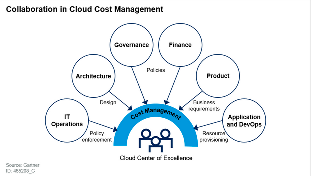

# ☁️ Cloud Cost Optimizer

A production-ready Cloud Cost Monitoring & Optimization platform built using React, Python (Flask), PostgreSQL, Docker, and AWS.

This project helps organizations monitor cloud usage, identify idle resources, reduce unnecessary spending, and maintain audit transparency.

---

## 🚀 Features

### 🔐 Authentication & Security
- Role-based access control (Admin / Viewer)
- JWT-based authentication
- Secure password hashing (bcrypt)
- OTP-based password reset via email
- Demo mode to protect admin access

### ☁️ Cloud Monitoring (AWS)
- Real-time EC2 instance listing
- CPU utilization monitoring (CloudWatch)
- Monthly cost estimation
- Intelligent optimization recommendations
- Alerts for budget and CPU spikes

### 📊 Dashboard
- Monthly cost overview
- Potential savings calculation
- Running vs stopped instances
- Clean, professional UI with all features

### 🧾 Audit Logs
- Full action audit trail (Start / Stop actions)
- Timezone-correct logging (IST)
- Pagination & date filtering
- Export logs as **CSV** or **PDF**

### 🐳 DevOps & Production Readiness
- Dockerized frontend + backend
- Environment-based configuration
- Secure secrets handling
- Production ready
- Demo Mode for public deployments

---

## 🟡 Demo Mode (Public Safe Mode)

This project supports a **Demo Mode** that allows public users to:
- Login as **Viewer**
- View dashboard and sample cloud data
- ❌ Cannot start/stop AWS instances
- ❌ Admin login disabled

This ensures **safe public demos** and protects real AWS resources.

---

## 🛠 Tech Stack

**Frontend**
- Java script
- React
- Tailwind CSS
- Axios
- nginx

**Backend**
- Python (Flask)
- SQLAlchemy
- Flask-JWT-Extended
- Boto3 (AWS SDK)

**Database**
- PostgreSQL

**DevOps**
- Docker & Docker Compose
- Environment-based configs

---

## ⚙️ Setup Instructions

### 1️⃣ Clone the repository
```bash
git clone https://github.com/Useramruth/cloud-cost-optimizer.git
cd cloud-cost-optimizer

2️⃣ Create .env file (NOT committed)--------------(// MAKE SURE THAT THIS IS FOR YOUR OWN AWS CREDENTIALS DATA)
POSTGRES_DB=cloud_optimizer
POSTGRES_USER=cloud_user
POSTGRES_PASSWORD=cloud123

JWT_SECRET_KEY=your_secret_key
AWS_REGION=ap-south-1

SMTP_EMAIL=your_email@gmail.com
SMTP_PASSWORD=your_app_password

DEMO_MODE=true

3️⃣ Start the application
docker compose up --build

4️⃣ Access the app

Frontend: http://localhost:3000

Backend API: http://localhost:5001

(-----------------👤 Default Demo Login-------------------) // NOTE THIS......
Username: Demo
Password: Demo@Cloud#2026
Role: Viewer

Admin login is disabled in Demo Mode.

(-----------------📌 Use Cases ---------------------)

College final-year project

DevOps / Cloud portfolio

Placement interviews

Safe public demo deployments

(---------------- 🧠 Project Highlights (For Interviews) -------------------)

Real-world cloud cost optimization logic

Secure authentication & authorization

Production-grade DevOps practices

Audit transparency & compliance mindset

Demo-safe architecture design


(--------🏗 Architecture Diagram -------------)



┌──────────────────┐
│   User Browser   │
│ (Desktop/Mobile) │
└─────────┬────────┘
          │ HTTPS
          ▼
┌──────────────────┐
│  React Frontend  │
│ (Vercel / Nginx) │
│  - Login / OTP   │
│  - Dashboard UI  │
└─────────┬────────┘
          │ REST API (JWT)
          ▼
┌──────────────────┐
│ Flask Backend API│
│  - Auth (JWT)    │
│  - OTP Email     │
│  - Cost Logic    │
│  - Audit Logs    │
└───────┬────┬─────┘
        │    │
        │    │
        ▼    ▼
┌─────────────┐   ┌────────────────┐
│ PostgreSQL  │   │   AWS Services │
│  (NeonDB)  │   │  - EC2          │
│  - Users   │   │  - CloudWatch   │
│  - Logs    │   │  - Cost Metrics │
└─────────────┘   └────────────────┘


📬 Author

Amruth

🔗 GitHub: https://github.com/Useramruth

🔗 LinkedIn: https://linkedin.com/in/jakkani-amruth


⭐ If you like this project

Give it a ⭐ on GitHub!
